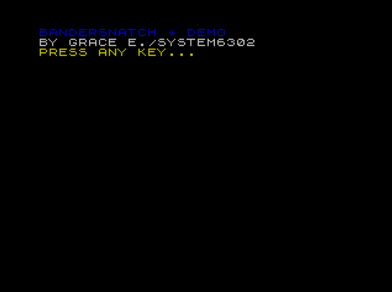
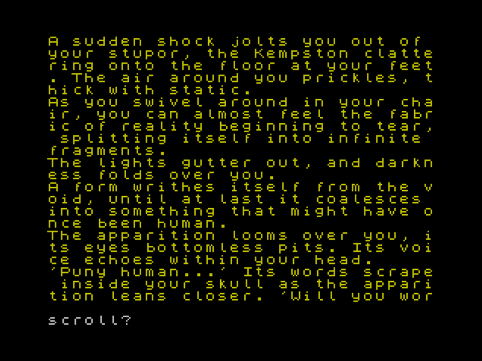
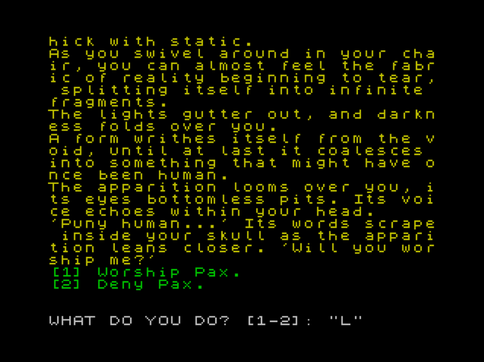

# Bandersnatch Damo [(Itch.io)](https://system6302.itch.io/bandersnatch-demo).

A short text adventure/interactive fiction game inspired by the Black Mirror interactive film Bandersnatch.
As a non-commercial fan game, it was created as a learning experience, with all rights belonging to the original creators and no profit being made.

##Screenshots

## How To Run

You will need a ZX Spectrum emulator to run this game. 
Fuse can be downloaded [here](https://fuse-emulator.sourceforge.net/).