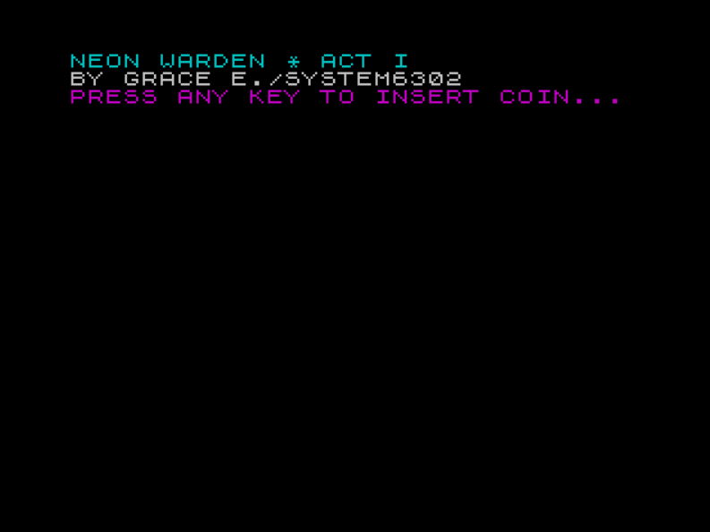
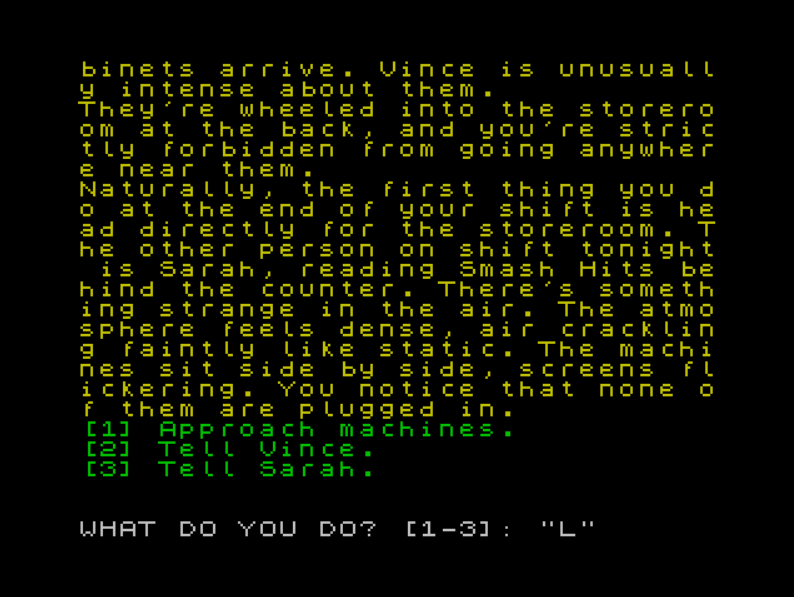

# Neon Warden (Act I) [(Itch.io)](https://system6302.itch.io/neon-warden-act-i).

The first part of Neon Warden, a text adventure/interactive fiction game involving arcade machines and the possibility of interdimensional travel.

##Screenshots

## How To Run

You will need a ZX Spectrum emulator to run this game. 
Fuse can be downloaded [here](https://fuse-emulator.sourceforge.net/).