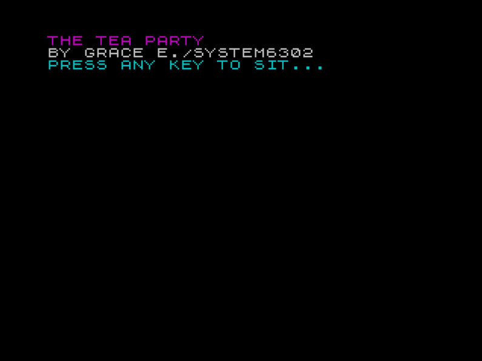
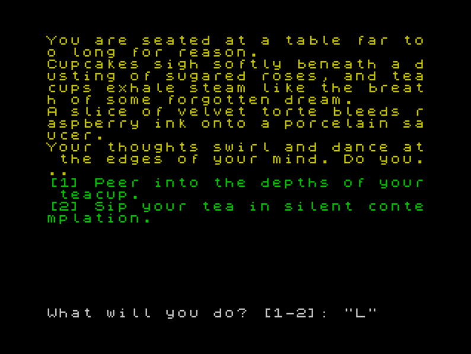

# The Tea Party [(Itch.io)](https://system6302.itch.io/the-tea-party).

A very short and strange text adventure/interactive fiction game inspired by Alice in Wonderland.

##Screenshots

## How To Run

You will need a ZX Spectrum emulator to run this game. 
Fuse can be downloaded [here](https://fuse-emulator.sourceforge.net/).